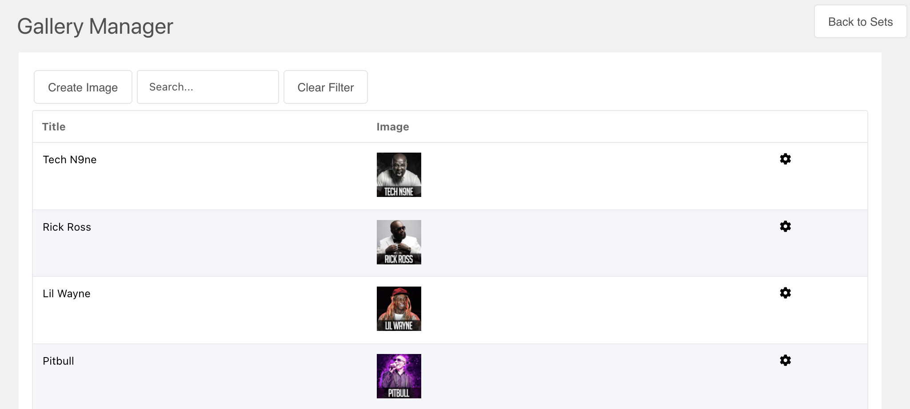

## Rocket Galleries

> Fork of FAQ Manager (https://github.com/josht/faqMan)

## Templates

The templates are divided into two parts, the set heading (setTpl) and the questions/answers (tpl).

### setTpl
To add headings to each set of FAQs, you will want to define this template. The template variables available in this template are:

- [[+id]]
- [[+count]]
- [[+name]]
- [[+description]]

The default template for this looks like this.

    <h2>
        [[+name]] ([[+count]])
        <div>[[+description]]</div>
    </h2>

### Tpl
The question/answer section template includes these placeholders

- [[+id]]
- [[+title]]
- [[+image]]
- [[+rank]]
- [[+set]]

The default template for this section looks like this

```
<div class="col-md-6 col-lg-4">

</div>
```

## Snippet call

To output your Sets, just place following snippet call in desired location:

    [[RocketGallery]]

*Calling it like this will output all sets and their images.*

A more specific call would be like this:

    [[RocketGallery?
      &set=`3`
      &tpl=`tpl`
      &setTpl=`setTpl`
    ]]

## Options

There are more options available to modify the call to your needs:

---

**set**             ID-value of FAQ set and lets you choose which FAQ set to display (if this is not specified ALL FAQ's will be displayed)

**tpl**             Name of the chunk to display your Questions/Answers

**setTpl**     Name of the chunk to display your FAQ set info

**sortBy**          This allows you to choose which field to sort by (default is rank).

**sortDir**         ASC / DESC

**setOutputSeparator** Separate each set with the given string.

---

A more complex call would look like this:

    [[RocketGallery?
      &set=`1`
      &tpl=`rg-img-tpl`
      &sortBy=`rank`
      &sortDir=`ASC`
      &limit=`10`
      &outputSeparator=`<hr>`
    ]]

---

    
